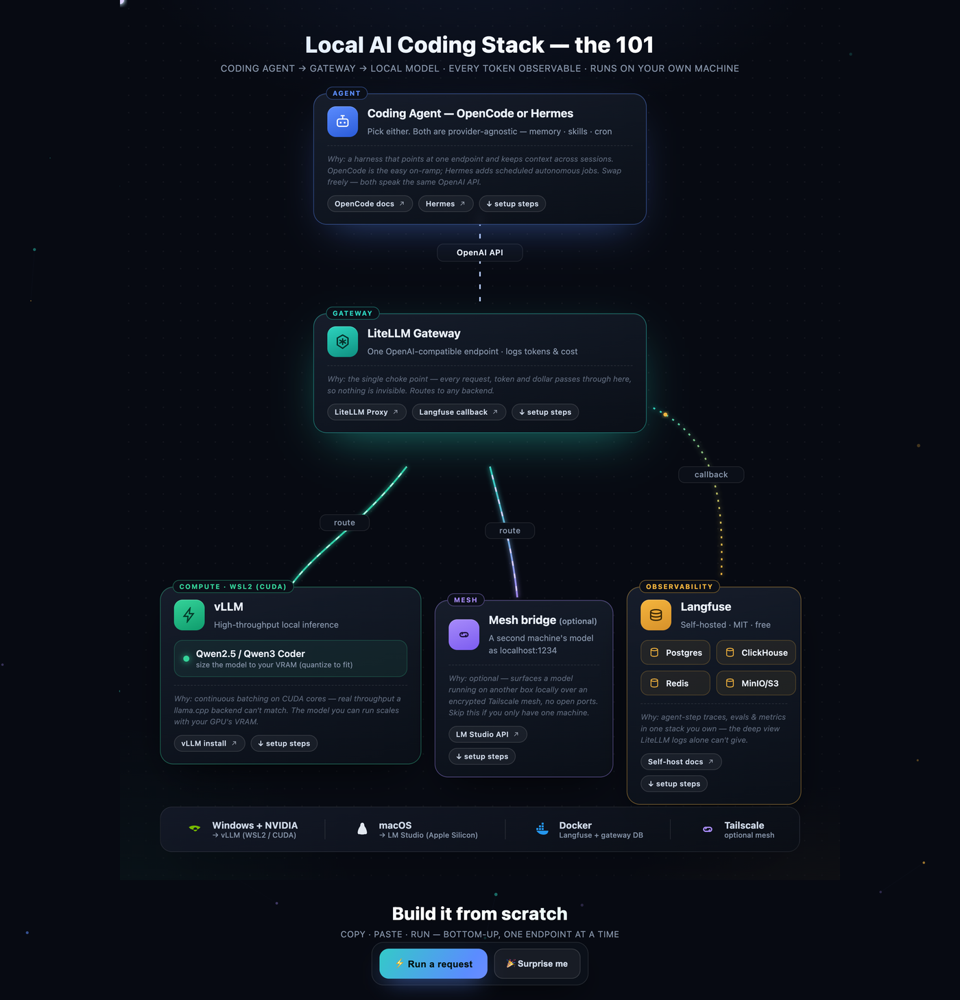
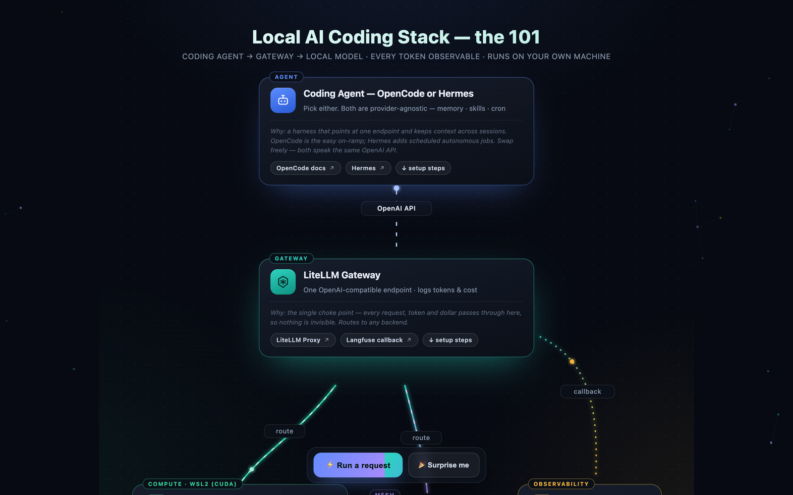
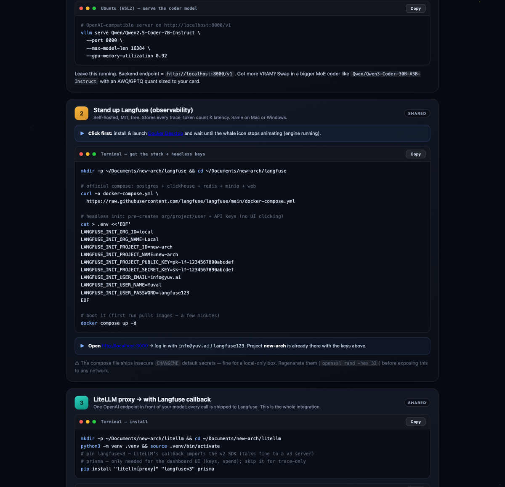
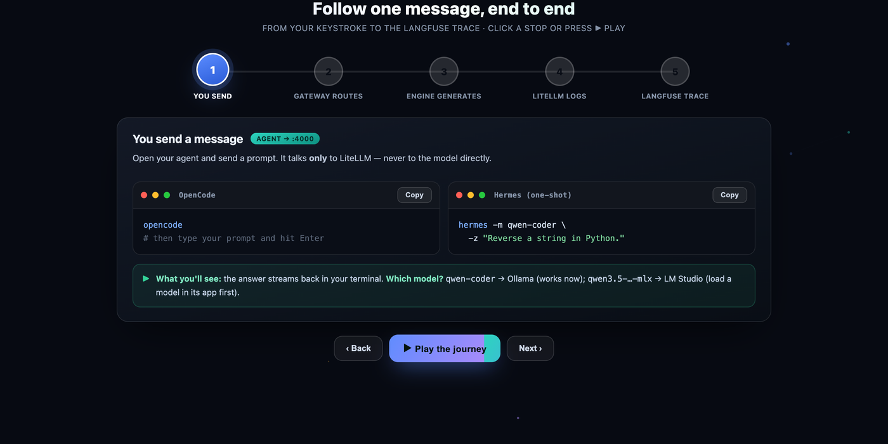

# Local AI Coding Stack — the 101

> Run a real coding agent against a **local** model, route every request through **one** OpenAI-compatible endpoint, and watch **every token** in a self-hosted dashboard. No cloud, no per-token bill, nothing invisible.

**▶ Live interactive guide:** **https://hoodini.github.io/local-ai-stack-101/**

An animated, single-page walkthrough of a fully-local, fully-observable AI coding setup — the spine you can build on your own machine in an afternoon. Works on **Windows + NVIDIA** (WSL2 / CUDA + vLLM) or **macOS** (Apple Silicon + LM Studio). The page is one self-contained `index.html` — no build step, no dependencies, no tracking.



---

## The idea in one sentence

```
Coding Agent  →  LiteLLM Gateway  →  Local Model        every token →  Langfuse
(OpenCode /        (one OpenAI-       (vLLM on NVIDIA /   (self-hosted traces,
 Hermes)            compatible URL)    LM Studio on Mac)    cost, latency)
```

**The golden rule:** the agent talks **only** to LiteLLM. That single choke point is why every request, token and dollar is observable — the agent never knows (or cares) whether vLLM or LM Studio actually answered. Swap the model behind the gateway and nothing upstream changes.

---

## What you get

| Layer | Role | Pick |
|-------|------|------|
| **Coding agent** | Where you actually write code | OpenCode (easy on-ramp) or Hermes (autonomous jobs, cron, skills) — both speak the OpenAI API |
| **LiteLLM gateway** | One OpenAI-compatible endpoint; logs tokens & cost | Routes to any backend, emits a Langfuse callback on every call |
| **Local model** | Does the inference, on your hardware | vLLM (NVIDIA/WSL2) or LM Studio (Apple Silicon). Size the model to your VRAM |
| **Langfuse** | Self-hosted observability | Every trace, token count, latency and cost — MIT, free, runs in Docker |
| **Mesh (optional)** | Reach a second machine's model | Tailscale, so a Mac can borrow a Windows box's GPU (or vice-versa) |



---

## Quickstart

> The live page has copy-paste blocks for each step with platform-specific commands. The short version:

1. **Stand up Langfuse** (Docker) — gives you the trace dashboard at `http://localhost:3000`.
2. **Run the LiteLLM proxy** with a Langfuse success/failure callback and a Postgres `DATABASE_URL` (the DB is what enables the `:4000/ui` login and key management).
3. **Point your agent at the gateway** — set `OPENAI_BASE_URL` to `http://localhost:4000` and use your local master key. The agent thinks it's talking to OpenAI.
4. **Make a request, then open Langfuse → Tracing** — your call appears with prompt, response, token counts and latency. If it's there, the spine works. ✅



Open **https://hoodini.github.io/local-ai-stack-101/** and click **⚡ Run a request** to watch the round-trip animate end-to-end.

---

## Where do I see my data?

- **LiteLLM UI** (`http://localhost:4000/ui`) → spend, request & token counts per model / key / day, plus key management.
- **Langfuse** (`http://localhost:3000`) → per-call traces: tokens in/out, latency, model, cost. Click any trace to drill in.

---

## Follow one message, end to end

The live page has an **interactive stepper** — click a stop or press **▶ Play** and each hop lights up the matching node in the diagram. Here's the same journey in text. A single prompt travels five stops:



**Before you start, open three tabs:** LiteLLM `:4000/ui` (login `admin` / `admin`), Langfuse `:3000` (the email + password you set on first run), and — if you're using LM Studio — its desktop app on the **Developer / Local Server** tab.

### 1 · You send a message — `agent → :4000`
Open your agent and send a prompt. It talks **only** to LiteLLM, never to the model directly.

```bash
# OpenCode — it's already pointed at the gateway
opencode
# then type your prompt and hit Enter

# …or Hermes, one-shot:
hermes -m qwen-coder -z "Reverse a string in Python."
```

> **Which model?** `qwen-coder` / `seed-coder` → Ollama (works immediately). `qwen3.5-…-mlx` → LM Studio (load a model in its app first).
> **What you'll see:** the answer streams back in your terminal.

### 2 · LiteLLM routes it — `gateway · :4000`
The gateway reads the **model name** and picks the backend — same request shape, different engine. This single choke point is *why* every token is observable: routing **and** the Langfuse callback both fire here.
> **What you'll see:** nothing to click — routing is instant. A copy of the call has already been shipped to Langfuse via the `success_callback: ["langfuse"]` line in `config.yaml`.

### 3 · The engine generates — `Ollama :11434 · LM Studio :1234`
Your local model does the actual inference, on your own hardware. Nothing leaves the machine.
> **What you'll see:** in **LM Studio**, the Developer/Local Server log shows `Received POST /v1/chat/completions` the instant you sent it. **Ollama** logs to its own console. That's proof the gateway routed *your* request into the engine.

### 4 · Watch it in LiteLLM — `:4000/ui · admin / admin`
Open the gateway dashboard and log in.
- **Logs** → newest row is your call; click it for the full request & response + token counts.
- **Usage** → spend, requests & tokens per model / key / day.

> **What you'll see:** your prompt, the reply, `prompt / completion / total` tokens, latency, and which backend answered.

### 5 · See the deep trace in Langfuse — `:3000 · Tracing`
Open Langfuse, pick your project, click **Tracing** in the sidebar.
- The **top row** (newest first) is your call — click it.
- Full **input + output** text, **model**, **latency**, **tokens** in/out, **cost**.

> **What you'll see:** the same call you saw in LiteLLM, now with full prompt/response and a timing span. If it shows up in **both** places, the spine works end to end. ✅ Cost reads ~$0 for local models — that's correct.

```
  Agent (OpenCode / Hermes)
        │  model name: "qwen-coder" or "qwen3.5-…-mlx"
        ▼
  LiteLLM :4000  ───────────────►  Logs + Usage   (gateway ledger)
        │  routes by name             │
        │                             └─ success_callback ─► Langfuse :3000  (full trace)
        ▼
  Engine: Ollama :11434  OR  LM Studio :1234   (the actual inference)
```

---

## A note on the example values

Every credential in this guide — `admin/admin`, `postgres:postgres@localhost`, `sk-local-master`, `sk-lf-…`, `langfuse123` — is an **intentional localhost placeholder** for teaching, not a real secret. They live behind `localhost` on your own machine. The compose file ships insecure `CHANGEME` defaults on purpose; **regenerate them** (`openssl rand -hex 32`) before exposing anything to a network. Nothing here is wired to a real deployment.

No hardware is hard-coded either — the guide is written for "NVIDIA on Windows" or "Apple Silicon on Mac" generically. Pick the model that fits your VRAM.

---

## Contributing

It's a single `index.html` (pure HTML/CSS/SVG/JS, zero dependencies). Edit it, open it in a browser, done. PRs that improve the explanations, add a platform, or polish the animations are welcome.

## License

[MIT](LICENSE) — use it, fork it, teach with it.
